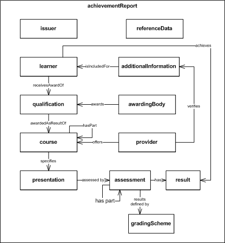

HEAR 1.0c Specification 
=======================

About
================================================================================================================================================================================================

### Status

This is the release version of v1.0c.

Changes from 1.0b:

-   All constraints consolidated to the Constraints section.

-   issuerDescription element added to &lt;issuer&gt; for conformance
    with EuroLMAI.

-   objective and learningOutcome changed so that only one or the other
    is mandatory.

### Patents

This specification is subject to a royalty free patent policy.

There are no known patents covering any of this work. If you think that
part of this work may be subject to an existing or pending patent,
please email the editors.

### Copyright and License

TBC

### Inspiration and acknowledgements

The authors wish to acknowledge the work of the supporting HEAR
Technical Specification Working Group, in particular:

-   John Bolland
-   Sarah Davies
-   Andy Dowling
-   Richard Entwistle
-   Simon Grant
-   Rob Ward
-   James Wong
-   Andy Youell

Introduction
==============================================================================================================================================================================================================

The Higher Education Achievement Report (HEAR) technical specification
defines an XML format for the content of the HEAR. It is intended to
enable the interoperability of descriptions of the Higher Education
achievement of learners between Higher Education providers, employers,
brokers and other relevant organisations. It is compliant with the \[CEN
European Learner Mobility Workshop Agreement CWA 16132
\]

A HEAR XML instance document typically consists of a top-level
&lt;achievementReport&gt; element, encapsulating:

-   a single &lt;issuer&gt; responsible for issuing the HEAR,
-   a single &lt;learner&gt;, the subject of the HEAR,
-   one or more &lt;provider&gt; elements, containing descriptions of
    the learning undertaken and a single exit qualification awarded as a
    result,
-   additional information about academic and non-academic achievements
    during the period of study not directly related to the qualification
    awarded,
-   formal certification of the HEAR.

The following diagram illustrates the main elements of the
specification.

[]

Normative References
==============================================================================================================================================================================================================================

\[XCRI-CAP 1.2\] eXchanging Course Related Information Course
Advertising Profile. See

\[EN 15982\] EN 15982: Metadata For Learning Opportunities (Advertising)

\[ISO 15836\] ISO 15836: Dublin Core Element Set

\[ISO 8601\] ISO 8601:Data elements and interchange formats —
Information interchange — Representation of dates and times

\[W3C DTF\] W3C Date and Time Formats. See

\[W3C XML Schema\] W3C XML Schema. See 

\[CWA 16077\] CWA 16077: Educational Credit Information Model

Conformance
============================================================================================================================================================================================================

There are two classes of application that can conform to this
specification:

-   A *producer* is a class of application that produces HEAR XML
    documents
-   An *consumer* is a class of application that consumers HEAR XML
    documents

A product MAY belong to both classes.

A **strictly conforming instance** is a set of structured information
constituted only of elements and attributes defined by this
specification and *fully qualified refinements* of the elements defined
in this specification.

A **fully qualified refinement** is defined for the purpose of
conformance as an element that explicitly extends an element defined by
this specification. A fully qualified refinement must be capable of
being processed according to the semantics of the element it extends.

A **conforming instance** MAY contain additional elements and attributes
not defined by this specification.

A **conforming producer** MUST be capable of generating and sharing
*strictly conforming instances*.

A **conforming consumer** MUST be capable of processing *strictly
conforming instances*.

HEAR Documents
==================================================================================================================================================================================================================

A producer MUST create HEAR documents that are valid XML documents.

A producer MUST create HEAR documents with the achievementReport element
as its top-level element.

A consumer MUST be able to process a valid HEAR XML document.

Guidelines *This section is not normative*

**Multilingual HEAR data sets:** Producers should create multiple XML
instances for HEAR data sets required entirely in more than one
language, for example English and Welsh.

The HEAR Template
-------------------------------------------------------------------------------------------------------------------------------------------------------------------------------------------------------------------------

*This section is not normative*

This specification covers the structure of the XML representation of the
HEAR data; it does not define the structure of the HEAR document per se.
The following information is provided to give context to the
specification of the data elements. Readers are asked to refer to the
[HEAR Guidance
Document](http://www.alanpaull.co.uk/HEAR/documents/HEAR_Guidance_DRAFT_FINAL_V6.pdf "http://www.alanpaull.co.uk/HEAR/documents/HEAR_Guidance_DRAFT_FINAL_V6.pdf") for more details.

A HEAR must adhere to the prescribed template described in the [HEAR
Guidance
Document](http://www.alanpaull.co.uk/HEAR/documents/HEAR_Guidance_DRAFT_FINAL_V6.pdf "http://www.alanpaull.co.uk/HEAR/documents/HEAR_Guidance_DRAFT_FINAL_V6.pdf") The Guidance defines the sections of the HEAR and requires that
sections are numbered and follow the sequence and explanatory guidance
given in the Guidance Document.

The structure of the template for a HEAR is as follows:

-   Contextual information
-   Section 1. Information identifying the holder of the qualification
-   Section 2. Information identifying the qualification
-   Section 3. Information on the level of the qualification
-   Section 4. Information on the contents and results gained
-   Section 5. Information on the function of the qualification
-   Section 6. Additional information
-   Section 7. Certification of the HEAR
-   Section 8. Information on the national higher education system

On output for printing or for viewing electronically a HEAR should
contain section numbering and standard statements as described in the
[HEAR Guidance
Document](http://www.alanpaull.co.uk/HEAR/documents/HEAR_Guidance_DRAFT_FINAL_V6.pdf "http://www.alanpaull.co.uk/HEAR/documents/HEAR_Guidance_DRAFT_FINAL_V6.pdf").

Contextual Information
-----------------------------------------------------------------------------------------------------------------------------------------------------------------------------------------------------------------------------------

*This section is not normative*

The [HEAR Guidance
Document](http://www.alanpaull.co.uk/HEAR/documents/HEAR_Guidance_DRAFT_FINAL_V6.pdf "http://www.alanpaull.co.uk/HEAR/documents/HEAR_Guidance_DRAFT_FINAL_V6.pdf") gives details of statements that should be included in the HEAR
at specified points, for example a standard statement at the start of
the HEAR should be included in order to meet the requirements of the
European Diploma Supplement (DS). Information about these statements is
included in the Guidance sections of this specification.

Guidelines In the Contextual Information of the HEAR,
institutions are advised to include the following statements:

*This Higher Education Achievement Report follows the model developed by
the European Commission, Council of Europe and UNESCO/CEPES for the
Diploma Supplement.*

*The purpose of the Supplement is to provide sufficient recognition of
qualifications (diplomas, degrees, certificates etc). It is designed to
provide a description of the nature, level, context and status of the
studies that were pursued and successfully completed by the individual
named on the original qualifications to which this Supplement is
appended. It should be free from any value judgements, equivalence
statements or suggestions about recognition. Information in all eight
sections should be provided. Where information is not provided, an
explanation should give the reason why.*

Producers are not required to include these statements or any other
statements recommended by the HEAR Implementation Steering Group within
the HEAR XML Data Set. Inclusion of these statements within HEAR
documents can be implemented using a variety of methods. This
specification makes provision for inclusion of of these statements in
the HEAR XML Data Set if desired by systems designers.

XML Document Structure
===================================================================================================================================================================================================================================

This section defines the root achievementReport element and relates the
main information elements of the HEAR XML document structure to this
root element. Definitions of the other elements are given in [Definition of Common Elements](#Definition_of_Common_Elements) and [Definition of Other
Elements](#Definition_of_Other_Elements) sections.

A HEAR XML document includes information drawn from Student Records
Systems, Course Information Systems and supporting systems that will be
created and maintained by various different administrative processes and
academic practices within academic institutions. The XML document
specification builds upon information about learners, descriptions of
programmes and other learning opportunity structures, information about
modules and other educational components enrolled on by learners,
assessment results and other accredited achievements for each completed
learning opportunity, and information about the awarding and providing
organisations themselves.

Constraints
-------------------------------------------------------------------------------------------------------------------------------------------------------------------------------------------------------------

1.  A valid HEAR MUST contain exactly one issuer element.
2.  A valid HEAR MUST contain exactly one learner element.
3.  A valid HEAR MUST contain one or more provider element.
4.  A valid HEAR MUST contain exactly one qualification element.
5.  A valid HEAR MUST contain exactly one top level course element.
6.  A valid HEAR MUST contain exactly one additionalInformation element.
    Guidance on its contents is given in the [HEAR Guidance
    Document](http://www.alanpaull.co.uk/HEAR/documents/HEAR_Guidance_DRAFT_FINAL_V6.pdf "http://www.alanpaull.co.uk/HEAR/documents/HEAR_Guidance_DRAFT_FINAL_V6.pdf").
7.  A valid HEAR MUST contain exactly one
    certificationOfTheHEAR element.
8.  A valid HEAR MUST contain exactly one identifier element for the
    following elements: assessment, certificationOfTheHEAR, course,
    presentation, qualification.
9.  A valid HEAR MUST contain one or more identifier elements for the
    following elements: issuer, learner, provider.
10. A valid exit HEAR &lt;achievementReport @status="1"&gt; MUST contain
    an assessment element for the programme and for each module or
    course component that the learner took as part of the programme or
    that is an additional academic credit-bearing student achievement
    detailed in the HEAR.
11. A valid exit HEAR &lt;achievementReport @status="1"&gt; MUST contain
    exactly one result element for each presentation taken by
    the learner.
12. A certificationOfTheHEAR element MUST contain exactly one
    issueDateHear element.
13. A certificationOfTheHEAR element MUST contain exactly one
    fullNameOfficial element.
14. A certificationOfTheHEAR element MUST contain exactly one
    capacity element.
15. Each assessment element MUST relate only to the learner and the
    specific version of the presentation on which the learner
    was assessed.
16. An assessment element MUST contain exactly one
    assessmentType element.
17. An assessment element MUST contain exactly one
    gradingScheme element.
18. The qualification instance MUST relate to the learner specified in
    the learner element.
19. The qualification MUST have been achieved as a result of completion
    of exactly one top level course instance.
20. Producers MUST ensure that the qualification instance of the HEAR
    relates directly to the top level course instance in a
    one-to-one relationship.
21. Producers MUST ensure that provider elements contain information
    only about providers of courses undertaken by the learner in the
    context of the qualification awarded.
22. The level element MUST contain the numerical position of the
    qualification in the relevant national qualifications framework.
23. Where an element has more than one identifier, it MUST NOT contain
    more than one identifier without an explicitly-defined encoding
    scheme, and this MUST be A Uniform Resource Identifier (URI)
    conforming to the URL scheme as specified by [IETF RFC
    3986](http://tools.ietf.org/html/rfc3986 "http://tools.ietf.org/html/rfc3986").
24. The top level course instance SHOULD define the Programme Level
    learning opportunity undertaken by the learner.
25. Course instances at levels lower than programme level SHOULD be
    related to the top level course instance using the isPartOf element,
    either directly through inclusion of the identifier of the top level
    course, or indirectly through inclusion of the identifier of another
    course element. See
    [example](HEAR_1.0c_Specification#Additional_elements_used_in_the_.3Ccourse.3E_element_at_other_levels "http://www.xcri.org/HEAR_1.0c_Specification#Additional_elements_used_in_the_.3Ccourse.3E_element_at_other_levels").
26. Instances of associate qualifications or other achievements not
    forming part of the learner's academic achievements as a result of
    following the indicated programme of study MAY be recorded in the
    Additional Information element.
27. Further course elements MAY be included to reflect the institution's
    programme component structures.
28. A valid HEAR MAY contain zero or one referenceData elements
    containing 'boilerplate' text.
29. If there are two or more provider elements, the first provider
    element SHOULD be the institution awarding the qualification.

element
-----------------------------------------------------------------------------------------------------------------------------------------------------------------------------------------------------------------------------------------------------------------

### Definition

The default root element for a HEAR.

### Main elements used within the achievementReport element

These main elements are listed here, so that the major components of a
HEAR are clearly indicated. Some of these elements are sub-elements of
top level elements, as noted in this guidance.

-   issuer
-   learner
-   awardedBy
-   qualification
-   provider
-   course
-   presentation
-   assessment
-   certificationOfTheHEAR
-   additionalInformation

**awardedBy:** A component of qualification (see
[XCRI-CAP](XCRI_CAP_1.2#the_.3Cqualification.3E_element "http://www.xcri.org/XCRI_CAP_1.2#the_.3Cqualification.3E_element"){.external
.text} specification).

**qualification:** A component of course (see
[XCRI-CAP](XCRI_CAP_1.2#the_.3Cqualification.3E_element "http://www.xcri.org/XCRI_CAP_1.2#the_.3Cqualification.3E_element"){.external
.text} specification).

**course:** A component of provider (see
[XCRI-CAP](XCRI_CAP_1.2#the_.3Ccourse.3E_element "http://www.xcri.org/XCRI_CAP_1.2#the_.3Ccourse.3E_element"){.external
.text} specification).

**presentation:** A component of course (see
[XCRI-CAP](XCRI_CAP_1.2#the_.3Cpresentation.3E_element "http://www.xcri.org/XCRI_CAP_1.2#the_.3Cpresentation.3E_element"){.external
.text} specification).

**assessment:** A component of presentation (see
[XCRI-CAP](XCRI_CAP_1.2#the_.3Cassessment.3E_element "http://www.xcri.org/XCRI_CAP_1.2#the_.3Cassessment.3E_element"){.external
.text} specification)

### \[[edit](http://www.xcri.org/wiki/index.php?title=HEAR_1.0c_Specification&action=edit&section=17 "Edit section: Elements used in the &lt;achievementReport&gt; element")\] Elements used in the &lt;achievementReport&gt; element

-   referenceData (optional, zero or one)
-   issuer (required, exactly one)
-   learner (required, exactly one)
-   provider (required, one or more)
-   additionalInformation (required, exactly one)
-   certificationOfTheHEAR (required, exactly one)

Guidelines *This section is not normative*

If there are two or more provider elements, the first provider element
SHOULD be the institution awarding the qualification.

### \[[edit](http://www.xcri.org/wiki/index.php?title=HEAR_1.0c_Specification&action=edit&section=18 "Edit section: Attributes used in the &lt;achievementReport&gt; element")\] Attributes used in the &lt;achievementReport&gt; element

-   @id\. Unique identifier for this HEAR.
-   @status\. Defines the type of this HEAR; enumeration: 1=Exit,
    2=Formative, 3=Deleted.

<a name="Definition_of_Common_Elements">Definition of Common Elements</a>
=================================================================================================================================================================================================================================================

Many of the elements in the HEAR use the following common elements. Also
see [Definition of Other Elements](#Definition_of_Other_Elements) For elements re-used from other namespaces (for example Dublin
Core, XCRI) refer to documentation for those specifications.

the &lt;identifier&gt; element
---------------------------------------------------------------------------------------------------------------------------------------------------------------------------------------------------------------------------------------------------

### Definition

An unambiguous reference to the resource within a given context. See
\[EN 15982\] and \[ISO 15836\].

### Namespaces

Uses namespace dc: .

Example:

     http://www.bolton.ac.uk
     23424341414
     1234

the &lt;title&gt; element
-----------------------------------------------------------------------------------------------------------------------------------------------------------------------------------------------------------------------------------------

### Definition

The name of the resource.

### Namespaces

See \[EN 15982\] and \[ISO 15836\].

Uses namespace dc: .

<a name="Definition_of_Other_Elements">Definition of Other Elements</a>
===============================================================================================================================================================================================================================================

the &lt;accessRequirements&gt; element
-------------------------------------------------------------------------------------------------------------------------------------------------------------------------------------------------------------------------------------------------------------------

### Definition

Details of the nature and length of qualifications or periods of study
required before starting the programme.

### Namespaces

Uses namespace xcri: .

Extension of xcri:descriptionDType.

 the &lt;additionalAwards&gt; element
---------------------------------------------------------------------------------------------------------------------------------------------------------------------------------------------------------------------------------------------------------------

### Definition

Information about academic (credit-based) and non-academic awards made
to the learner.

### Namespaces

Uses namespace xcri: .

Extension of xcri:descriptionDType.

the &lt;additionalInformation&gt; element
-------------------------------------------------------------------------------------------------------------------------------------------------------------------------------------------------------------------------------------------------------------------------

### Definition

Details of the richer picture of verified student achievement, including
additional awards (with or without academic credit), additional
recognised activities, and university, professional and departmental
prizes.

### Namespaces

Uses elm: European Learner Mobility Achievement Information (EuroLMAI),
for which see CWA 16132.

### Elements used in the &lt;additionalInformation&gt; element

-   **prizes** (optional, zero, one or many)
-   **additionalAwards** (optional, zero, one or many)
-   **recognisedActivities** (optional, zero, one or many)
-   **informationSources** (optional, zero, one or many)
-   **ePortfolioUrl** (optional, zero or one)
-   **furtherInformation** (optional, zero, one or many)

the &lt;aim&gt; element
-------------------------------------------------------------------------------------------------------------------------------------------------------------------------------------------------------------------------------------

### Definition

Describes the aim(s) of the programme.

### Namespaces

Uses mlo:\[EN 15982\] EN 15982: Metadata For Learning Opportunities
(Advertising)

Represented as mlo:objective.

Guidelines *This section is not normative*

    
    ...
         
              
                   
                        To provide flexible teaching and learning programmes of high quality, in which students can develop their own interests.
                        To provide a stimulating and supportive environment for all students to work in.
                        To provide an education that will enable graduates to follow a variety of careers, including higher degrees and research.
                        To enable all students to have a broad appreciation of Biological Sciences and advanced knowledge of one or more areas.
                        To enable all students to develop subject-specific knowledge with practical and transferable skills.
                        To enable all students to experience, within the 4 year options, work in an external research laboratory or European University.
                   
              
         
    

the &lt;assessment&gt; element
---------------------------------------------------------------------------------------------------------------------------------------------------------------------------------------------------------------------------------------------------

### Definition

The details of the way in which the learner's performance in the
presentation of the course was judged.

### Namespaces

Uses namespace xcri: .

Uses elm: European Learner Mobility Achievement Information (EuroLMAI),
for which see [CWA
16132](http://www.cen-wslt.din.de/sixcms_upload/media/3378/CWA16132.pdf "http://www.cen-wslt.din.de/sixcms_upload/media/3378/CWA16132.pdf"){.external
.text}.

Uses eds: [European Diploma
Supplement](http://europass.cedefop.europa.eu/europass/home/vernav/InformationOn/EuropassDiplomaSupplement.csp "http://europass.cedefop.europa.eu/europass/home/vernav/InformationOn/EuropassDiplomaSupplement.csp"){.external
.text}

### Elements used in the &lt;assessment&gt; element

-   **identifier** (required, exactly one), dc:identifier
-   **assessmentType** (required, exactly one)
-   **assessmentWeight** (optional, zero or one)
-   **attempts** (optional, zero or one)
-   **result** (optional, zero, one or many)
-   **gradingScheme** (required, exactly one)

Guidelines **result:** Required in an exit HEAR, at least one per
assessment.

the &lt;assessmentType&gt; element
-----------------------------------------------------------------------------------------------------------------------------------------------------------------------------------------------------------------------------------------------------------

### Definition

Description of the style of the assessment.

Guidelines *This section is not normative*

**assessmentType:** It is recommended that producers use an encoding
scheme or controlled vocabulary for this item.

the &lt;assessmentWeight&gt; element
---------------------------------------------------------------------------------------------------------------------------------------------------------------------------------------------------------------------------------------------------------------

### Definition

Weighting of the assessment result as a proportion of the overall
assessment for the presentation.

the &lt;attempts&gt; element
-----------------------------------------------------------------------------------------------------------------------------------------------------------------------------------------------------------------------------------------------

### Definition

Number of times the learner has made at the assessment.

the &lt;awardedBy&gt; element
-------------------------------------------------------------------------------------------------------------------------------------------------------------------------------------------------------------------------------------------------

### Definition

This element identifies and names the recognised organisation (Awarding
Body) that confers the qualification upon the learner.

### Attributes

-   @idRef\. The idRef attribute MUST identify the Awarding Body specified in
    the awardedBy element. It MUST be A Uniform Resource Identifier (URI)
    conforming to the URL scheme as specified by [IETF RFC
    3986](http://tools.ietf.org/html/rfc3986 "http://tools.ietf.org/html/rfc3986").

Note Where the Awarding Body is not the provider, a second
provider element should be created that contains the relevant details of
the awarding body. The identifier in the awardedBy element identifies
this organisation, and the provider element for the awarding body must
contain &lt;providerStatus&gt; and a course element that identifies the
programme, the qualification and confirms the awarding body through the
&lt;qualification&gt; and &lt;awardedBy&gt; structure. This structure
enables compliance with XCRI-CAP and EuroLMI.

the &lt;capacity&gt; element
-----------------------------------------------------------------------------------------------------------------------------------------------------------------------------------------------------------------------------------------------

Definition

The official post of the certifying individual.

the &lt;certificationOfTheHEAR&gt; element
---------------------------------------------------------------------------------------------------------------------------------------------------------------------------------------------------------------------------------------------------------------------------

### Definition

Provides evidence that the HEAR is a genuine document produced by the
authorised organisation.

### Namespaces

Uses namespace dc: 

### Elements used in the &lt;certificationOfTheHEAR&gt; element

-   **identifier** (required, exactly one), dc:identifier. Uniquely
    identifies this version of the HEAR data set for this learner.
-   **issueDateHear** (required, exactly one)
-   **fullNameOfficial** (required, exactly one)
-   **capacity** (required, exactly one)
-   **signature** (optional, zero or one).

the &lt;course&gt; element
-------------------------------------------------------------------------------------------------------------------------------------------------------------------------------------------------------------------------------------------

### Definition

A course element provides details of a learning opportunity offered by a
learning provider.

### Namespaces

Uses namespace xcri: .

Uses mlo: \[EN 15982\] EN 15982: Metadata For Learning Opportunities
(Advertising)

Uses namespace dc: 

### Common elements used in the &lt;course&gt; element at all levels

-   **identifier** (required, exactly one), dc:identifier
-   **title** (required, exactly one), dc:title. Full official name of
    the programme.
-   **type** (required, exactly one), dc:type
-   **credit** (optional, multiple), mlo:credit (defined in mlo)
-   **presentation** (required, exactly one)

### Additional elements used in the &lt;course&gt; element at Programme Level

-   **aim** (optional, zero or one), mlo:objective.
-   **learningOutcome** (optional, zero or one)
-   **specialFeature** (optional, zero, one or many)
-   **qualification** (required, exactly one)

Note At least one of &lt;aim&gt; or &lt;learningOutcome&gt; must
be supplied.

### Additional elements used in the &lt;course&gt; element at other levels

-   **isPartOf** (required, exactly one)

Guidelines *This section is not normative*

Programme and course component linkage example, in relation to
constraint 'Course instances at levels lower than programme level should
be related to the top level course instance using the isPartOf element,
either directly through inclusion of the identifier of the top level
course, or indirectly through inclusion of the identifier of another
course element':

        
            
            1234
            Information and Communications Undergraduate Programme
        
        
            
            1234-01
            Digital Media and Communications - Stage 1
            1234
        
        
            
            M223
            Information Literacies for the Digital Age
            1234-01
        

**credit:** credit values should contain credits achieved by the
learner. If this is not possible, display required credits.

\

the &lt;dateOfBirth&gt; element
-----------------------------------------------------------------------------------------------------------------------------------------------------------------------------------------------------------------------------------------------------

### Definition

Date when the learner was born. This value MUST be in ISO 8601 date
format as refined by W3C DTF 'Complete Date': yyyy-mm-dd (example:
"1985-05-16").

### Namespaces

Uses scop: the SEMIC-EU Core Person Specification (not yet published in
machine readable form), which is compatible with EuroLMAI.

the &lt;dualAward&gt; element
-------------------------------------------------------------------------------------------------------------------------------------------------------------------------------------------------------------------------------------------------

### Definition

Gives details if the qualification is a dual award, for example between
two UK institutions or between a UK and European institution.

### Namespaces

Uses namespace xcri: .

Extension of xcri:descriptionDType.

the &lt;duration&gt; element
-----------------------------------------------------------------------------------------------------------------------------------------------------------------------------------------------------------------------------------------------

### Definition

The length of the programme.

The content of this element MUST be human readable text of the form
'value' followed by 'unit of time', for example 'Three years'. The
duration SHOULD be expressed in years, unless the course is shorter than
two years, in which case an expression in months or weeks is acceptable.

Producers MAY include a machine-readable attribute 'interval' that
follows the ISO 8601 standard.

Guidelines *This section is not normative*

Example

        Three years

the &lt;ePortfolioUrl&gt; element
---------------------------------------------------------------------------------------------------------------------------------------------------------------------------------------------------------------------------------------------------------

### Definition

A hypertext link to the learner's ePortfolio.

the &lt;familyName&gt; element
---------------------------------------------------------------------------------------------------------------------------------------------------------------------------------------------------------------------------------------------------

### Definition

Full family or surname, as included on official documents, such as a
passport.

### Namespaces

Uses elm: European Learner Mobility Achievement Information (EuroLMAI).

the &lt;fullName&gt; element
-----------------------------------------------------------------------------------------------------------------------------------------------------------------------------------------------------------------------------------------------

### Definition

The complete name of the learner; components should be those included on
official documents, such as a passport.

### Namespaces

Uses elm: European Learner Mobility Achievement Information (EuroLMAI).

the &lt;fullNameOfficial&gt;
-----------------------------------------------------------------------------------------------------------------------------------------------------------------------------------------------------------------------------------------------

### Definition

Full name of the official certifying the HEAR.

the &lt;furtherInformation&gt; element
-------------------------------------------------------------------------------------------------------------------------------------------------------------------------------------------------------------------------------------------------------------------

### Definition

Information within the Additional Information element not covered
elsewhere.

### Namespaces

Uses namespace xcri: .

Extension of xcri:descriptionDType.

the &lt;furtherStudy&gt; element
-------------------------------------------------------------------------------------------------------------------------------------------------------------------------------------------------------------------------------------------------------

### Definition

Indicates if, within the country of origin, the qualification normally
provides access (not admission) to further academic and/or professional
study, especially leading to any specific qualifications, or levels of
study.

### Namespaces

Uses namespace xcri: .

Extension of xcri:descriptionDType.

Guidelines *This section is not normative*

**furtherStudy:** Include the grades or standards normally necessary to
allow progression within the EHEA.

For example:

*Access to postgraduate study: Bologna FQ-EHEA 3rd cycle PhD or MD.*

*Access to postgraduate study: Bologna FQ-EHEA 2nd cycle degree or
diploma.*

the &lt;givenNames&gt; element
---------------------------------------------------------------------------------------------------------------------------------------------------------------------------------------------------------------------------------------------------

### Definition

All given or first names in the order specified by the learner, as
included on official documents, such as a passport.

### Namespaces

Uses elm: European Learner Mobility Achievement Information (EuroLMAI).

the &lt;gradingScheme&gt; element
---------------------------------------------------------------------------------------------------------------------------------------------------------------------------------------------------------------------------------------------------------

### Definition

Information about the grading scheme used for the assessment of a
presentation.

the &lt;identifierDescription&gt; element
-------------------------------------------------------------------------------------------------------------------------------------------------------------------------------------------------------------------------------------------------------------------------

### Definition

Used to indicate the provenance of the identifier or identifiers.
Required text for the HUSID is as follows:

"HUSID (HESA Unique Student Identifier) is the unique national
identifying number for students registered at a UK university. It is
defined by HESA, the UK's Higher Education Statistics Agency."

### Namespaces

Uses namespace xcri: .

Extension of xcri:descriptionDType.

the &lt;informationSources&gt; element
--------------------------------------------------------------------------------------------------------------------------------------------------------------------------------------------------------------------------------------------------------------------

### Definition

Further information sources and references where more details on the
qualification could be sought.

### Namespaces

Uses namespace xcri: .

Extension of xcri:descriptionDType.

the &lt;isPartOf&gt; element
------------------------------------------------------------------------------------------------------------------------------------------------------------------------------------------------------------------------------------------------

### Definition

Indicates the parent course element.

The isPartOf element MUST contain only the identifier of the parent
course element.

the &lt;issueDateHear&gt; element
----------------------------------------------------------------------------------------------------------------------------------------------------------------------------------------------------------------------------------------------------------

### Definition

Date and time of the production of this HEAR.

### Namespaces

Uses namespace xcri: .

xcri:dateOrDateTimeDType

the &lt;issueDateQualification&gt; element
----------------------------------------------------------------------------------------------------------------------------------------------------------------------------------------------------------------------------------------------------------------------------

### Definition

Date on which the qualification was awarded.

### Namespaces

Uses elm: European Learner Mobility Achievement Information (EuroLMAI),
for which see CWA 16132.

the &lt;issuer&gt; element
--------------------------------------------------------------------------------------------------------------------------------------------------------------------------------------------------------------------------------------------

### Definition

The organisation that is responsible for producing the HEAR.

### Namespaces

Uses namespace dc: 

### Elements used in the &lt;issuer&gt; element

-   **identifier**, dc:identifier (required, one or more)
-   **title**, dc:title (required, one or more)
-   **issuerDescription**, (required, exactly one)

Guidelines *This section is not normative*

**identifier**: This element identifiers the issuing organisation, which
may be a different organisation from the provider or the awarding body,
for example a broker.

**issuer**: This element must not contain any other elements. Further
elements describing the organisation(s) offering the course or awarding
the qualification must be contained in the provider element.

**issuerDescription**: This element is included for compliance with the
Europass Diploma Supplement Application Profile of the EuroLMAI.

\

the &lt;issuerDescription&gt; element
------------------------------------------------------------------------------------------------------------------------------------------------------------------------------------------------------------------------------------------------------------------

### Definition

A short description of the issuer.

### Namespaces

Uses namespace dc: 

the &lt;learner&gt; element
----------------------------------------------------------------------------------------------------------------------------------------------------------------------------------------------------------------------------------------------

### Definition

Information identifying the holder of the qualification.

### Namespaces

Uses elm: European Learner Mobility Achievement Information (EuroLMAI).

Uses scop: the SEMIC-EU Core Person Specification (not yet published in
machine readable form), which is compatible with EuroLMAI.

Uses namespace dc: 

### Elements used in the &lt;learner&gt; element

-   **identifier** (required, one or more), dc:identifier. Unique
    identifier for the learner. Where the HESA Unique Student
    Identifier (HUSID) is known, for example stored in the Student
    Record System, this value MUST be the learner's HUSID. In other
    cases a different authoritative identifier MUST be used. For
    identifiers other than the HUSID, ULN or SCN implementers MUST
    either extend the identifier element to include another namespace or
    indicate the provenance of the identifier in the comment attribute.
-   **identifierDescription** (optional, zero, one or more)
-   **familyName** (required, exactly one)
-   **givenNames** (required, exactly one)
-   **fullName** (optional, zero or one)
-   **dateOfBirth** (required, exactly one)

Guidelines *This section is not normative*

**identifier**: Alternatives recommended in this specification include
the Unique Learner Number (ULN) and the Scottish Candidate Number (SCN).
Namespace refinements for these identifiers are included in the HEAR XML
schema. An internal identifier from an issuer, provider or awarding body
can also be included.

**dateOfBirth**: Note that this specification does not prescribe the
final form output for date (for example in a PDF or paper document);
implementers may wish to present the date to end users in an alternative
format. Additionally there may be applications, such as outputs for
employers, in which the inclusion of the learner's birthday is not
required.

the &lt;learningOutcome&gt; element
--------------------------------------------------------------------------------------------------------------------------------------------------------------------------------------------------------------------------------------------------------------

### Definition

Describes the overall learning outcome(s) of the programme.

### Namespaces

Uses namespace xcri: .

Extension of xcri:descriptionDType.

the &lt;level&gt; element
------------------------------------------------------------------------------------------------------------------------------------------------------------------------------------------------------------------------------------------

### Definition

Numerical position of the qualification in the relevant national
qualifications framework.

The level element MUST contain the numerical position of the
qualification in the relevant national qualifications framework.

the &lt;minimumStandards&gt; element
----------------------------------------------------------------------------------------------------------------------------------------------------------------------------------------------------------------------------------------------------------------

### Definition

Details of the regulations covering the minimum standards required to
secure the qualification; therefore applies to the Programme only.

### Namespaces

Uses namespace xcri: .

Extension of xcri:descriptionDType.

the &lt;presentation&gt; element
--------------------------------------------------------------------------------------------------------------------------------------------------------------------------------------------------------------------------------------------------------

### Definition

Details of the instance or version of the course enrolled on.

### Namespaces

Uses namespace xcri: .

Uses mlo: \[EN 15982\] EN 15982: Metadata For Learning Opportunities
(Advertising)

Uses namespace dc: 

### Common elements used in the &lt;presentation&gt; element at all levels

-   **identifier** (required, exactly one), dc:identifier. Where
    presentation does not have its own identifier, producers SHOULD use
    and repeat the host course identifier
-   **assessment** (optional, zero, one or many). In an exit HEAR this
    element MUST be present for each presentation, otherwise it
    is optional.

### element at Programme Level only")\] Elements used in the &lt;presentation&gt; element at Programme Level only

-   **start** (required, exactly one), mlo:start (defined in mlo)
-   **end** (required, exactly one), xcri:end (defined in xcri)
-   **accessRequirements** (required, exactly one)
-   **minimumStandards** (required, exactly one)
-   **duration** (required, exactly one)
-   **studyMode** (required, exactly one), xcri:studyMode (defined in
    xcri)\[suggested amendment: There is no prescribed vocabulary for
    studyMode used in the HEAR. AEP\]
-   **languageOfInstruction** (required, at least one),
    mlo:languageOfInstruction (defined in mlo)
-   **languageOfAssessment** (required, at least one),
    xcri:languageOfAssessment (defined in xcri)

Guidelines *This section is not normative*

There are no additional elements only used in the &lt;presentation&gt;
element at other levels.

**title:** Producers should draw the title from the course element, not
the presentation element.

**accessRequirements**: Producers may implement this content using
'boilerplate' text and a hyperlink to specific documents held elsewhere;
in this case, implementers should have regard to the persistence of the
hyperlinks and the associated content, for example: "Detailed
information regarding admission to the programme is available in the
University’s on-line Prospectus at:
www.easthampton.ac.uk/admissions/ugprospectus/06." See [HEAR Guidance
Document](http://www.alanpaull.co.uk/HEAR/documents/HEAR_Guidance_DRAFT_FINAL_V6.pdf "http://www.alanpaull.co.uk/HEAR/documents/HEAR_Guidance_DRAFT_FINAL_V6.pdf"){.external
.text}, section 3.3.

**minimumStandards**: See [HEAR Guidance
Document](http://www.alanpaull.co.uk/HEAR/documents/HEAR_Guidance_DRAFT_FINAL_V6.pdf "http://www.alanpaull.co.uk/HEAR/documents/HEAR_Guidance_DRAFT_FINAL_V6.pdf"){.external
.text}, section 4.2.

**Output of languageOfInstruction and languageOfAssessment:** Consumers
should present final form output of these elements as human readable
text.

**Absence of languageOfInstruction and languageOfAssessment:** Where
these elements are missing, consumers should interpret this as meaning
that the language of instruction and assessment was English (en-GB).

the &lt;prizes&gt; element
--------------------------------------------------------------------------------------------------------------------------------------------------------------------------------------------------------------------------------------------

### Definition

Information about university, professional and departmental prizes
awarded to the learner.

### Namespaces

Uses namespace xcri: .

Extension of xcri:descriptionDType.

the &lt;professionalStatus&gt; element
--------------------------------------------------------------------------------------------------------------------------------------------------------------------------------------------------------------------------------------------------------------------

### Definition

Details of any rights to practise or other professional standing
accorded to holders of the award.

### Namespaces

Uses namespace xcri: .

Extension of xcri:descriptionDType.

Guidelines *This section is not normative*

The institution may use a generic statement from a professional body or
one of its own devising (see [HEAR Guidance
Document](http://www.alanpaull.co.uk/HEAR/documents/HEAR_Guidance_DRAFT_FINAL_V6.pdf "http://www.alanpaull.co.uk/HEAR/documents/HEAR_Guidance_DRAFT_FINAL_V6.pdf").

the &lt;provider&gt; element
------------------------------------------------------------------------------------------------------------------------------------------------------------------------------------------------------------------------------------------------

### Definition

An organisation that offers one or more courses.

Note Where the provider is also the awarding body, the provider
identifier MUST match the awardedBy identifier.

### Namespaces

Uses namespace xcri: 

### Elements used in the &lt;provider&gt; element

-   **identifier** (required, at least one), dc:identifier. Unique
    identifier for the provider.
-   **title** (required, at least one), dc:title. Full official name of
    the provider.
-   **description** (optional, zero or one), dc:description
-   **providerStatus** (required, one only)
-   **course** (required, at least one)

the &lt;providerStatus&gt; element
------------------------------------------------------------------------------------------------------------------------------------------------------------------------------------------------------------------------------------------------------------

### Definition

Describes the legal status of the provider, for example as either a
'recognised body' or a 'listed body'.

the &lt;qualification&gt; element
----------------------------------------------------------------------------------------------------------------------------------------------------------------------------------------------------------------------------------------------------------

### Definition

A status awarded to or conferred on a learner by an awarding body.

### Namespaces

Uses namespace xcri: .

Uses elm: European Learner Mobility Achievement Information (EuroLMAI),
for which see [CWA
16132](http://www.cen-wslt.din.de/sixcms_upload/media/3378/CWA16132.pdf "http://www.cen-wslt.din.de/sixcms_upload/media/3378/CWA16132.pdf"){.external
.text}.

Uses eds: [European Diploma
Supplement](http://europass.cedefop.europa.eu/europass/home/vernav/InformationOn/EuropassDiplomaSupplement.csp "http://europass.cedefop.europa.eu/europass/home/vernav/InformationOn/EuropassDiplomaSupplement.csp"){.external
.text}

Uses namespace dc: 

### Elements used in the &lt;qualification&gt; element

-   **identifier** (required, exactly one), dc:identifier. Unique
    identifier for the qualification.
-   **title** (required, exactly one), dc:title. Full official name of
    the award.
-   **regulations** (required, exactly one)
-   **dualAward** (optional, zero or one)
-   **professionalStatus** (optional, zero or one)
-   **furtherStudy** (optional, zero or one)
-   **terminalAward** (optional, zero or one)
-   **subject** (required, at least one), dc:subject
-   **level** (required, exactly one)
-   **qualificationHolderTitle** (optional, zero or one),
    qualificationHolderTitle (eds)
-   **issueDateQualification** (required, exactly one), issueDate (elm)
-   **awardedBy** (required, exactly one)

the &lt;qualificationHolderTitle&gt; element
--------------------------------------------------------------------------------------------------------------------------------------------------------------------------------------------------------------------------------------------------------------------------------

### Definition

Nationally accepted title conferred by the award, for example *Bachelor
of Science (Honours)*.

### Namespaces

Uses eds: [European Diploma
Supplement](http://europass.cedefop.europa.eu/europass/home/vernav/InformationOn/EuropassDiplomaSupplement.csp "http://europass.cedefop.europa.eu/europass/home/vernav/InformationOn/EuropassDiplomaSupplement.csp"){.external
.text}

the &lt;recognisedActivities&gt; element
------------------------------------------------------------------------------------------------------------------------------------------------------------------------------------------------------------------------------------------------------------------------

### Definition

Information about other recognised non-credit-bearing activities
undertaken by the learner.

### Namespaces

Uses namespace xcri: .

Extension of xcri:descriptionDType.

the &lt;referenceData&gt; element
----------------------------------------------------------------------------------------------------------------------------------------------------------------------------------------------------------------------------------------------------------

### Definition

Container for standard, repeated or generic text used in the HEAR.

### Namespaces

Uses namespace xcri: .

### Elements used in the &lt;referenceData&gt; element

-   **referenceDataItem** (required, one or more)

the &lt;referenceDataItem&gt; element
------------------------------------------------------------------------------------------------------------------------------------------------------------------------------------------------------------------------------------------------------------------

### Definition

Holds standard, repeated or generic text ('boilerplate' text). This text
will typically be recommended text from the [HEAR Guidance
Document](http://www.alanpaull.co.uk/HEAR/documents/HEAR_Guidance_DRAFT_FINAL_V6.pdf "http://www.alanpaull.co.uk/HEAR/documents/HEAR_Guidance_DRAFT_FINAL_V6.pdf"){.external
.text}. It can also be used for generic assessment grading schemes that
might be repeated for a large number of modules, or for standardised
learning outcomes, so that these pieces of text can be referenced rather
than repeated.

### Namespaces

Uses namespace xcri: .

Extension of xcri:descriptionDType.

the &lt;regulations&gt; element
------------------------------------------------------------------------------------------------------------------------------------------------------------------------------------------------------------------------------------------------------

### Definition

Describes the regulations concerning degree-awarding powers in the UK.

Guidelines *This section is not normative*

The recommended text is: "The power to award degrees is regulated by law
in the UK."

### Namespaces

Uses namespace xcri: .

Extension of xcri:descriptionDType.

the &lt;result&gt; element
--------------------------------------------------------------------------------------------------------------------------------------------------------------------------------------------------------------------------------------------

### Definition

The actual outcome of a presentation for a learner as stated by a
provider or issuer.

### Namespaces

Uses elm: European Learner Mobility Achievement Information (EuroLMAI),
for which see [CWA
16132](http://www.cen-wslt.din.de/sixcms_upload/media/3378/CWA16132.pdf "http://www.cen-wslt.din.de/sixcms_upload/media/3378/CWA16132.pdf").

### Attributes used in the &lt;result&gt; element

-   @resultType. Indicates whether the result is a mark, grade
    or similar.

Guidelines *This section is not normative*

-   **result**: Where any zeros or mark reductions have occurred, it is
    recommended that producers record them here.

-   **@resultType**: It is recommended that producers use an encoding
    scheme or controlled vocabulary for this item.

the &lt;signature&gt; element
--------------------------------------------------------------------------------------------------------------------------------------------------------------------------------------------------------------------------------------------------

### Definition

A reference to an image of a signature of the responsible official.

### Namespaces

Uses namespace xcri: .

Represented as xcri:imageDType.

Guidelines *This section is not normative*

Producers should implement specific security measures to protect the
image. This element is concerned with the graphical image of the
signature, not with the digital signature. The actual graphical image
should be external to the XML.

It is recommended that producers protect any HEAR document with an
appropriate digital signature to ensure document authenticity and
integrity.

the &lt;specialFeature&gt; element
------------------------------------------------------------------------------------------------------------------------------------------------------------------------------------------------------------------------------------------------------------

### Definition

Any particular features that help define the programme that are not
covered elsewhere.

### Namespaces

Uses namespace xcri: .

Extension of xcri:descriptionDType.

the &lt;subject&gt; element
----------------------------------------------------------------------------------------------------------------------------------------------------------------------------------------------------------------------------------------------

### Definition

Main field(s) of study for the qualification.

### Namespaces

Uses namespace dc: .

Guidelines *This section is not normative*

**subject:** Producers should put each main field of study in a separate
element. On output, the elements should be concatenated to form one
string. There is no nationally approved vocabulary for the subject in a
HEAR. Use the institution's own terminology. If subjects or fields of
study are not held in respect of qualifications, use the subjects in
respect of the top level course (programme) element.

the &lt;terminalAward&gt; element
----------------------------------------------------------------------------------------------------------------------------------------------------------------------------------------------------------------------------------------------------------

### Definition

Specifies if the qualification is a terminal (end) award or part of a
hierarchy of awards.

### Namespaces

Uses namespace xcri: .

Extension of xcri:descriptionDType.

the &lt;type&gt; element
----------------------------------------------------------------------------------------------------------------------------------------------------------------------------------------------------------------------------------------

### Definition

Indicates the position of the course in a hierarchy with Programme at
the top and Module or Unit at the bottom; for example programme, a
module-level component or a grouping component such as semester,
programme year, level or subject of a programme.

### Namespaces

Uses namespace dc: .

XML Schema and Instance
======================================================================================================================================================================================================================================

*This section is not normative*

A W3C XML Schema is available at
.

A sample XML instance file is available at
.

XCRI-CAP 1.2 schema and supporting schemas are available from the XCRI
[website](http://www.xcri.co.uk/bindings/xcri_cap_1_2.xsd "http://www.xcri.co.uk/bindings/xcri_cap_1_2.xsd"){